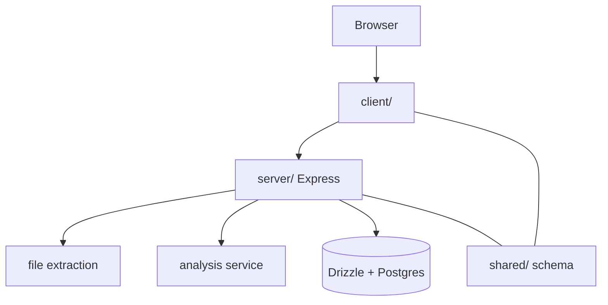

# Covenant

Document analysis web app: React client, Express API, and Postgres persistence
through Drizzle. Upload PDF or DOCX files, extract text server-side, and run
model-backed analysis with session-scoped history.

## Architecture



## Development

```bash
npm install
npm run dev
```

Set model and database credentials in the environment before running analysis
outside local dev defaults.

## Repository map

| Path | Role |
| --- | --- |
| `client/` | UI, routing, auth hooks |
| `server/` | HTTP API, Vite dev integration, persistence |
| `shared/` | Schema shared across tiers |

## License

MIT
