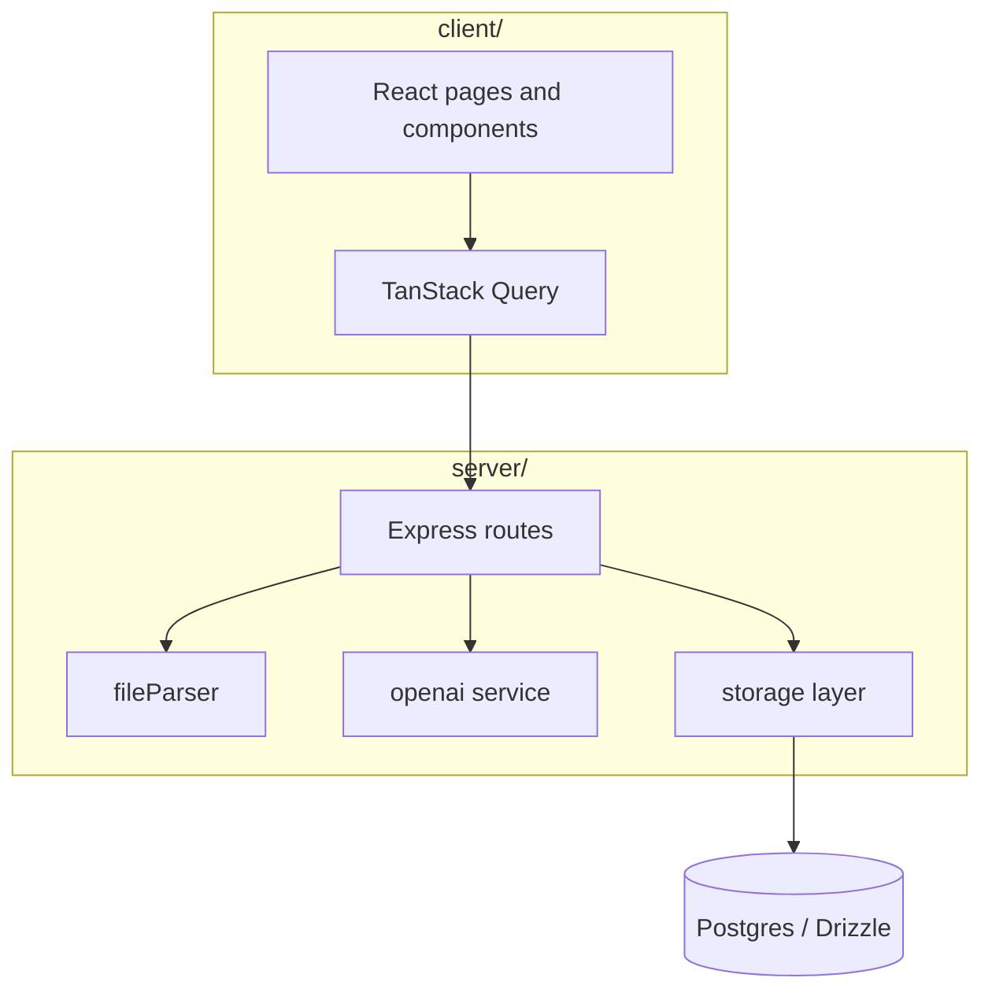

# Contract analyzer

Full-stack app for uploading PDF or DOCX documents, extracting text, and running
structured analysis (contracts and resumes) through a hosted model API. Sessions
are anonymous-friendly with server-side storage for history and profile settings.

## Architecture



## Stack

- **Client:** React, Vite, Tailwind, shadcn-style UI primitives
- **Server:** Express, multer uploads, session cookies
- **Data:** Drizzle ORM, shared Zod schemas in `shared/schema.ts`

## Run locally

```bash
npm install
npm run dev
```

Set `OPENAI_API_KEY` (and database URL if not using the default dev setup) before
analyzing documents.

## Project layout

| Path | Purpose |
| --- | --- |
| `client/src/pages/` | Dashboard, analysis flow, profile |
| `server/routes.ts` | Upload and analysis endpoints |
| `server/services/` | OpenAI calls and document parsing |
| `shared/` | Shared types and validation |

## License

MIT
