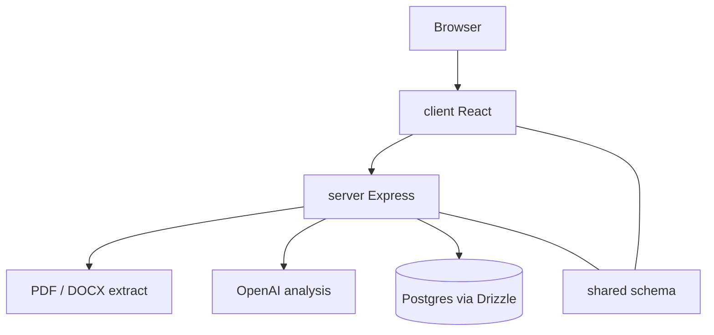

# Covenant

Document analysis for contracts and resumes. Upload PDF or DOCX, extract text
server-side, run model-backed review, and inspect findings in a session-scoped
dashboard.

## Architecture



## Run

```bash
cp .env.example .env
npm install
npm run db:push
npm run dev
```

`SESSION_SECRET` is required when `NODE_ENV=production`. Without `OPENAI_API_KEY`,
analysis routes fail closed rather than inventing sample text.

## Layout

| Path | Role |
| --- | --- |
| `client/` | Dashboard, analysis view, profile |
| `server/` | Upload, extract, analyze, sessions |
| `shared/` | Drizzle schema and Zod types |

## License

MIT
