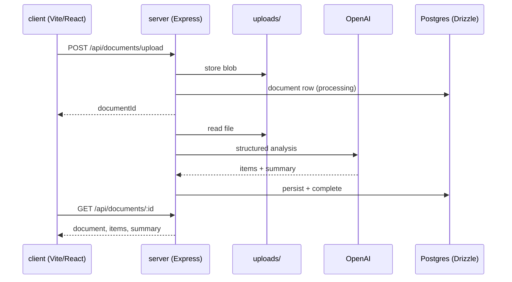

# Covenant

End-to-end document analysis: multipart upload (PDF/DOCX), server-side text extraction, structured LLM review, and a session-scoped React dashboard. One TypeScript monorepo with shared Drizzle/Zod types across client and server.

## What it does

| Stage | Behavior |
| --- | --- |
| Ingest | Multer to `uploads/`, 10 MB cap, PDF + DOCX only |
| Extract | `pdf-parse` / `mammoth`; failures return **422** (no synthetic fallback text) |
| Analyze | Background job calls OpenAI; persists line items + summary |
| Review | Dashboard lists documents; analysis view shows extracted text + findings |

Anonymous sessions via `express-session` cookie. No OAuth path in this tree.

## Architecture



## HTTP surface

| Method | Path | Purpose |
| --- | --- | --- |
| `POST` | `/api/documents/upload` | Upload; body `documentType`: `contract` \| `resume` |
| `GET` | `/api/documents` | List for current session |
| `GET` | `/api/documents/:id` | Document + analysis items + summary |
| `GET` / `POST` | `/api/profile` | Session profile read/update |
| `GET` | `/api/contracts/:id` | Legacy alias; same payload + `contract` / `clauses` keys |

## Data model (Drizzle)

- **documents** - file metadata, `analysisStatus`, optional `extractedText`
- **analysis_items** - per-clause or per-finding rows linked to `documentId`
- **analysis_summaries** - roll-up text / scores for the document
- **profiles** - optional name/email/bio keyed by `sessionId`

Schema lives in `shared/schema.ts`; push with `npm run db:push`.

## Stack

| Layer | Choices |
| --- | --- |
| Client | React 18, Vite, TanStack Query, Tailwind, Radix-based UI |
| Server | Express, multer, session cookies, esbuild production bundle |
| Data | Drizzle ORM, `@neondatabase/serverless` driver |
| Validation | Zod (shared with client types) |

## Run

```bash
cp .env.example .env
npm install
npm run db:push
npm run dev
```

**Production:** set `DATABASE_URL`, `OPENAI_API_KEY`, and `SESSION_SECRET` (`NODE_ENV=production` enforces the secret; cookies use `secure` in prod).

**Quality:** `npm run check` (tsc), `npm run build` (client + server). CI runs both on push.

## Repository map

| Path | Role |
| --- | --- |
| `client/src/pages/` | Dashboard, analysis, profile |
| `server/routes.ts` | Upload + read API |
| `server/services/` | `fileParser.ts`, `openai.ts` |
| `server/storage.ts` | Drizzle persistence |
| `docs/ARCHITECTURE.md` | Request lifecycle notes |

## License

MIT
