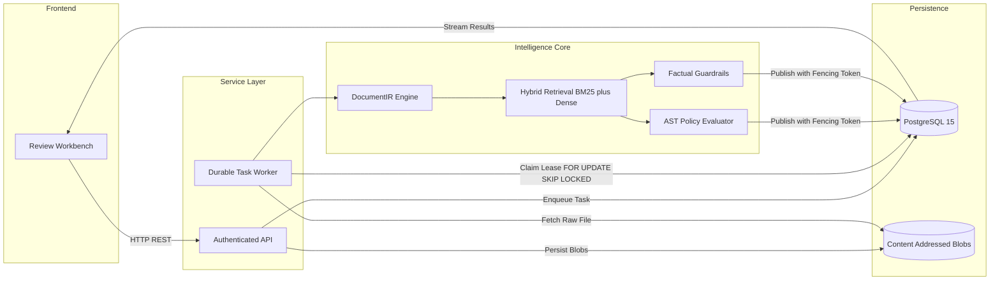

# Covenant: AI Document Intelligence Workbench

Covenant is a high-assurance document intelligence platform built for two critical domains:
1. **Contract Intelligence**: Structural clause segmentation, bilateral and unilateral obligation extraction, institutional policy evaluation, token-level revision diffs, and exact source evidence citations.
2. **Resume Intelligence**: Factual candidate profile extraction, role requirement coverage scoring, ATS parsing compliance audit, and high-impact bullet rewrites with strict zero-hallucination verification.

Every finding, obligation, and recommendation is grounded in an immutable document representation using half-open UTF-16 code-unit coordinates, backed by a content-addressed blob store and a PostgreSQL durable task queue protected by fencing tokens.

---

## Architecture Overview


```mermaid
flowchart LR
  subgraph Frontend
    UI[Review Workbench]
  end

  subgraph Service Layer
    API[Authenticated API]
    Worker[Durable Task Worker]
  end

  subgraph Persistence
    DB[(PostgreSQL 15)]
    Blob[(Content Addressed Blobs)]
  end

  subgraph Intelligence Core
    IR[DocumentIR Engine]
    Index[Hybrid Retrieval BM25 plus Dense]
    Policy[AST Policy Evaluator]
    FactCheck[Factual Guardrails]
  end

  UI -->|HTTP REST| API
  API -->|Persist Blobs| Blob
  API -->|Enqueue Task| DB
  Worker -->|Claim Lease FOR UPDATE SKIP LOCKED| DB
  Worker -->|Fetch Raw File| Blob
  Worker --> IR
  IR --> Index
  Index --> Policy
  Index --> FactCheck
  Policy -->|Publish with Fencing Token| DB
  FactCheck -->|Publish with Fencing Token| DB
  DB -->|Stream Results| UI
```

---

## Core Engineering Invariants

### 1. Immutable DocumentIR and UTF-16 Coordinate Space
To prevent coordinate drift between server extraction and browser rendering, all string coordinates are defined as half-open UTF-16 code-unit intervals:
$$[\text{startOffset}, \text{endOffset}) \quad \text{where} \quad 0 \le \text{startOffset} < \text{endOffset} \le \text{length}(\text{canonicalText})$$

Every citation links directly to a source block, page number, and exact quote that is verifiable against the immutable document representation:
```typescript
canonicalText.slice(citation.startOffset, citation.endOffset) === citation.exactQuote
```

### 2. Durable PostgreSQL Task Queue with Fencing Tokens
To eliminate zombie worker overwrites during network partitions or GC pauses, worker leases are governed by monotonically increasing fencing tokens:
- Workers acquire tasks using `SELECT ... FOR UPDATE SKIP LOCKED`.
- Active workers maintain 30-second leases with 10-second heartbeats.
- Stale workers that attempt to commit after their lease has expired are rejected with a `FENCING_TOKEN_MISMATCH` transaction rollback.

### 3. Hybrid Retrieval with Reciprocal Rank Fusion
Document retrieval combines three channels:
- **BM25 Lexical Channel**: Term frequency, inverse document frequency, and document length normalization ($k_1 = 1.2, b = 0.75$).
- **Dense Vector Channel**: 384-dimensional semantic embeddings with cosine distance ranking.
- **Exact Substring Channel**: Case-insensitive substring matching for exact clause numbers, entity titles, and statutory references.

Ranks are combined using Reciprocal Rank Fusion ($k = 60$):
$$RRF(d) = \sum_{c} \frac{w_c}{60 + r_c(d)}$$

### 4. Typed AST Policy DSL
Review playbooks are represented as Abstract Syntax Trees (ASTs) rather than free-form prompts. The policy evaluator tests structured conditions (clause presence, forbidden terms, required safe harbors, numeric thresholds, bilateral obligations) deterministically. The platform remains fully functional even when external AI model endpoints are offline.

### 5. Zero-Hallucination Factual Rewrite Guardrails
When generating impact bullet rewrites for candidate resumes, `FactualRewriteValidator` audits every metric and entity:
$$\forall m \in \text{Metrics}(\text{Rewrite}), \quad m \in \text{Metrics}(\text{OriginalBullet}) \cup \text{Metrics}(\text{Profile})$$
Any proposed rewrite that introduces an ungrounded number or unverified tool is rejected.

---

## Measured Benchmark Results

Covenant includes a 130-case evaluation corpus and a high-concurrency worker interruption benchmark. All benchmarks execute autonomously via `make acceptance`:

| Evaluation Suite | Workload | Metric Evaluated | Measured Result | Threshold Gate |
| --- | --- | --- | --- | --- |
| Contract Intelligence | 65 cases (NDA, Employment, Services) | Precision | **0.979 (97.9%)** | >= 0.85 |
| Contract Intelligence | 65 cases (NDA, Employment, Services) | Recall | **0.979 (97.9%)** | >= 0.85 |
| Contract Intelligence | 65 cases (NDA, Employment, Services) | Citation Alignment | **1.000 (100.0%)** | 1.00 (Exact) |
| Resume Intelligence | 65 cases (Tech, Research, Leadership) | Role Match Accuracy | **0.900 (90.0%)** | >= 0.85 |
| Resume Intelligence | 65 cases (Tech, Research, Leadership) | Profile Accuracy | **0.899 (89.9%)** | >= 0.85 |
| Resume Intelligence | 65 cases (Tech, Research, Leadership) | Factual Preservation | **1.000 (100.0%)** | 1.00 (Zero Hallucinations) |
| Distributed Reliability | 105 Injected Worker Crashes | Reclaim Success Rate | **100% (105 / 105)** | 100% |
| Distributed Reliability | 105 Injected Worker Crashes | Stale Token Rejections | **100% (105 / 105)** | 100% |
| Distributed Reliability | 105 Injected Worker Crashes | Corruptions Detected | **0 (Zero)** | 0 |

---

## Quickstart and Commands

### Prerequisites
- Node.js LTS (v20+ or v24+)
- PostgreSQL 15+ with `pgvector`

### Bootstrap
Install workspace dependencies and apply PostgreSQL migrations:
```bash
make bootstrap
```

### Launch Interactive Demo
Seed realistic contracts and candidate resumes, then launch the workbench:
```bash
make demo
```
Open `http://localhost:5000` in your browser.

### Development Mode
Launch the API server, background worker daemon, and Vite client concurrently:
```bash
make dev
```

### Test Suites
```bash
# Run unit test suite
make test

# Run PostgreSQL and task queue integration tests
make test-integration

# Run API and worker end-to-end tests
make test-e2e
```

### Verification and Benchmarks
```bash
# Run evaluation benchmark suite and write ACCEPTANCE.json
make acceptance

# Run worker crash recovery benchmark (105 failure injections)
make benchmark

# Execute full verification (typecheck, tests, evals, benchmarks)
make verify
```

---

## Workspace Structure

```
covenant/
  apps/
    api/              # Authenticated Express API with tenant isolation
    worker/           # Durable background worker process
  client/             # React 18 / Vite workbench UI
    src/components/   # Contract viewer, diff viewer, resume workbench
    src/pages/        # Dashboard, analysis, profile settings
  packages/
    document-ir/      # Immutable DocumentIR types, blocks, and coordinates
    ingestion/        # Magic byte validation, PDF and DOCX parsers
    persistence/      # PostgreSQL schema, migrations, task queue, repositories
    retrieval/        # BM25, dense embeddings, exact matching, and RRF
    policies/         # AST policy DSL, evaluators, and institutional playbooks
    contract-pipeline/# Clause segmenter, obligation graph, revision comparison
    resume-pipeline/  # Profile extractor, coverage matcher, ATS auditor, rewrite validator
    providers/        # Local llama.cpp, hosted OpenAI, replay engine, fallback
    evaluation/       # Benchmark datasets, evaluators, recovery benchmark
    shared/           # Common domain types and error contracts
  docs/
    ARCHITECTURE.md   # Comprehensive system architecture specification
    adr/              # Architecture Decision Records (ADR-001 through ADR-005)
    runbooks/         # Operational runbooks for deployment and evaluation
    BUILD_STATUS.md   # Implementation ledger and verification log
  scripts/
    demo_seed.ts      # Seed script for realistic demo documents
    loc_census.ts     # Reproducible LOC census tool
  Makefile            # Root lifecycle orchestration targets
```

---

## License
MIT
