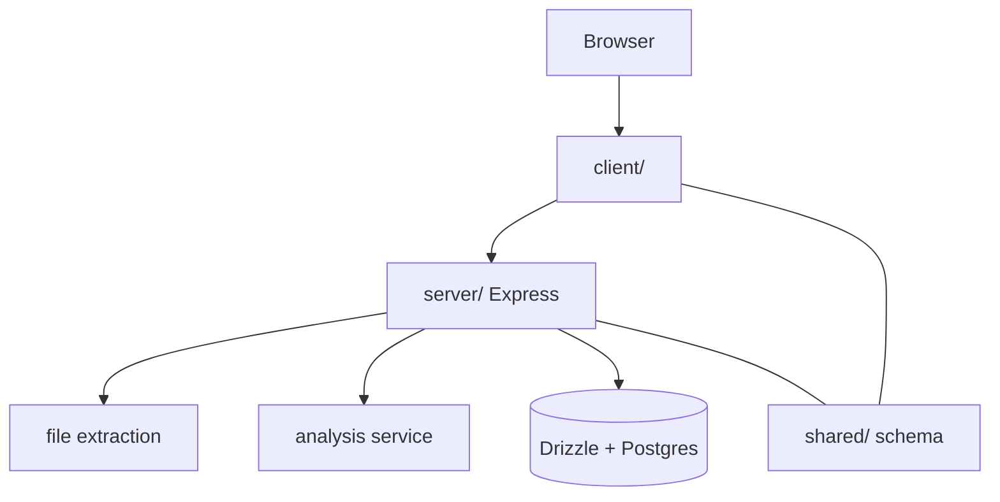

# Covenant

```mermaid
flowchart TB
  Browser --> Web[client/]
  Web --> API[server/ Express]
  API --> Parser[file extraction]
  API --> Model[analysis service]
  API --> DB[(Drizzle + Postgres)]
  Web --- Shared[shared/ schema]
  API --- Shared
```

Document uploads flow through multer, text extraction, and model analysis with
session-scoped storage. Shared Zod/Drizzle types keep the client and server in
sync.
