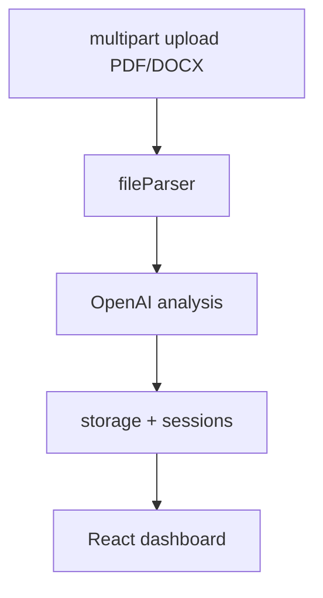

# Contract analyzer

```mermaid
flowchart TB
  Upload[multipart upload PDF/DOCX] --> Parse[fileParser]
  Parse --> LLM[OpenAI analysis]
  LLM --> Store[storage + sessions]
  Store --> UI[React dashboard]
```

Sessions are keyed for anonymous use. Uploaded files land in `uploads/` during
processing and metadata lives in Postgres through Drizzle models in
`shared/schema.ts`.
