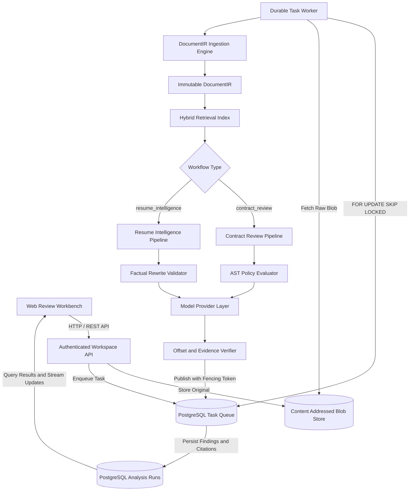
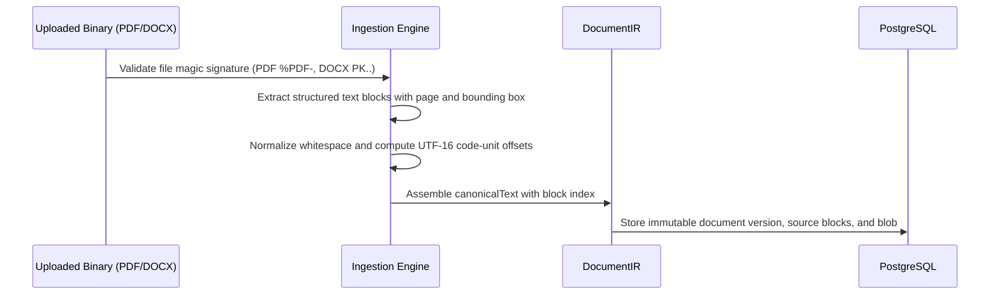
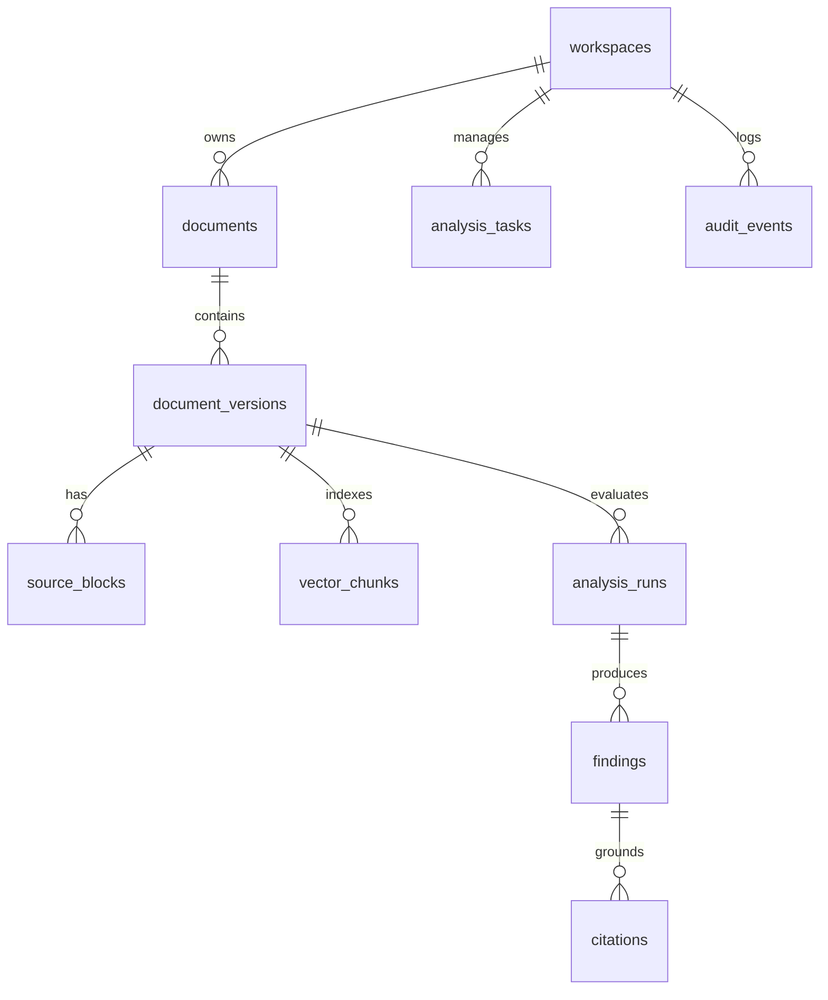
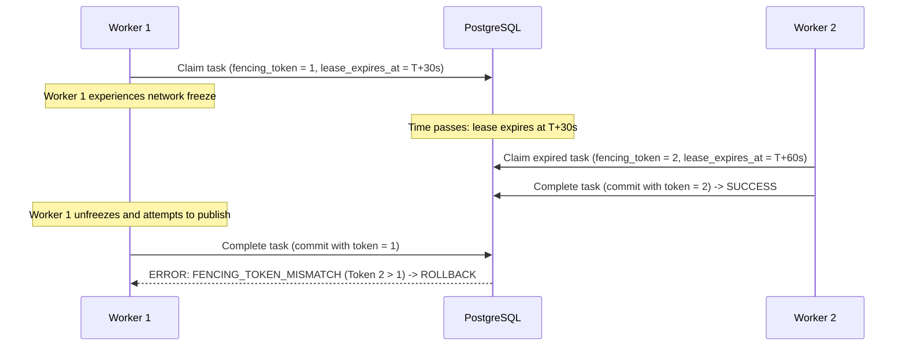
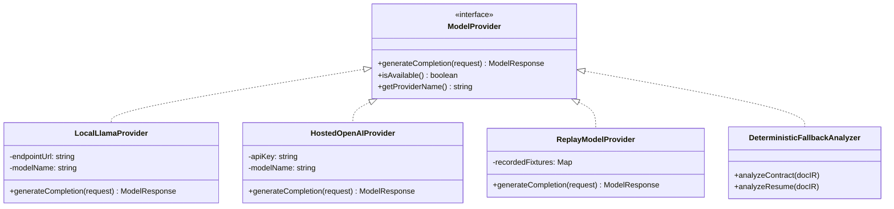

# Architecture Specification: Covenant Document Intelligence Workbench

## 1. System Overview and Core Mission

Covenant is an AI document intelligence workbench engineered for two substantial enterprise review domains:
1. **Contract Review**: Extracting structural clause hierarchies, resolving bilateral and unilateral obligations, detecting institutional policy deviations, computing token-level redline diffs between revisions, and grounding every finding in exact source evidence.
2. **Resume Intelligence**: Reconstructing factual candidate career profiles, evaluating candidate coverage against granular role requirements, auditing ATS structural parsing compliance, and generating high-impact bullet rewrites with strict zero-hallucination verification.

The core architectural invariant across both domains is immutable, verifiable evidence grounding. Every finding produced by the platform links to verifiable code-unit coordinate spans in an immutable document representation, backed by a content-addressed storage layer and a durable task queue.



---

## 2. Bounded Contexts and Package Hierarchy

The workspace is organized into modular packages with explicit contracts and strict boundary encapsulation:

- **`packages/document-ir`**: Core schema, AST types, source block representations, coordinate offsets, and serialization utilities for the immutable document intermediate representation.
- **`packages/ingestion`**: File signature validation, magic byte checking, container inspection, PDF text run extraction with reading-order heuristics, DOCX XML paragraph and table parsing, and OCR normalization.
- **`packages/persistence`**: PostgreSQL Drizzle schema, versioned SQL migrations, content-addressed filesystem blob store, workspace isolation queries, repository layers, and the durable task queue engine.
- **`packages/retrieval`**: Hybrid retrieval engine integrating BM25 inverted index term matching, 384-dimensional dense semantic embeddings, exact canonical substring search, and Reciprocal Rank Fusion (RRF).
- **`packages/policies`**: Abstract Syntax Tree (AST) policy domain-specific language (DSL), condition evaluation engine, and institutional playbooks for Non-Disclosure Agreements (NDAs), Employment Agreements, and Master Services Agreements (MSAs).
- **`packages/contract-pipeline`**: Clause segmentation, heading hierarchy reconstruction, bilateral and unilateral obligation extraction, entity resolution, and semantic revision comparison.
- **`packages/resume-pipeline`**: Candidate profile extraction, career timeline reconstruction, role requirement parser, coverage matcher, ATS compliance auditor, and factual rewrite validator.
- **`packages/providers`**: Unified model provider abstraction with local llama.cpp HTTP client, hosted OpenAI provider, deterministic recorded replay engine, and rule-based fallback analyzer.
- **`packages/evaluation`**: 130-case benchmark corpus (65 contract, 65 resume), evaluation runners scoring precision, recall, citation alignment, and fact preservation, plus high-concurrency worker crash recovery benchmarks.
- **`apps/api`**: Authenticated Express HTTP service providing workspace-scoped document upload, task monitoring, findings triage, and revision comparison endpoints.
- **`apps/worker`**: Dedicated background worker daemon that claims tasks via row-level locks, manages lease heartbeats, and publishes analysis runs under fencing token protection.
- **`client`**: React 18 and Vite frontend application featuring canonical text highlighting, redline patch diffs, reviewer triage workflows, and resume intelligence views.

---

## 3. Document Representation and Coordinate Invariants

### 3.1 Half-Open UTF-16 Code-Unit Offsets

A primary defect in legacy document intelligence systems is coordinate drift between server-side string slicing and client-side web rendering. Covenant enforces a universal coordinate contract:

$$\text{Offset Span} = [\text{startOffset}, \text{endOffset}) \quad \text{where} \quad 0 \le \text{startOffset} < \text{endOffset} \le \text{length}(\text{canonicalText})$$

All character offsets in `DocumentIR`, `sourceBlocks`, `citations`, and `findings` are half-open UTF-16 code units. This matches the standard indexing behavior of ECMAScript string slicing (`String.prototype.slice(start, end)`), avoiding multi-byte character boundary corruption.

### 3.2 Canonical Text Construction and Source Maps

During document ingestion:
1. Extracted blocks (paragraphs, headings, list items, table cells) are normalized: carriage returns (`\r\n`) are replaced with standard newlines (`\n`), and continuous runs of intra-line whitespace are collapsed.
2. Each block is assigned a globally unique identifier (`blockId`), page number, bounding box (for PDFs), and canonical offsets `[canonicalStart, canonicalEnd)`.
3. The full canonical text is assembled by concatenating block strings separated by double newlines (`\n\n`), ensuring that every text character maps directly back to a parent source block and page number.



---

## 4. Persistence Architecture and Multi-Tenancy

### 4.1 Schema Isolation and Referential Integrity

All persistent domain records reside in PostgreSQL under strict referential integrity constraints:
- `workspaces`: Top-level tenant container. All documents, analysis runs, findings, and tasks include a foreign key constraint referencing `workspaces.id`.
- `documents`: Logical document entity tracking title, media type, and pointer to `current_version_id`.
- `document_versions`: Content-addressed immutable snapshots storing `sha256`, `byte_size`, `extractor_version`, `canonical_text`, and the complete `document_ir_json`.
- `source_blocks`: Granular block-level hierarchy for high-speed coordinate translation and citation verification.
- `vector_chunks`: Document chunks with 384-dimensional vector embeddings stored via `pgvector` for dense semantic search.
- `analysis_tasks`: Durable task state machine managing distributed worker leases.
- `analysis_runs`: Immutable publication records containing `summary_json`, `model_metadata_json`, and the authorizing `fencing_token`.
- `findings`: Grounded policy violations, obligations, or ATS recommendations.
- `citations`: Exact source evidence quotes tied to half-open canonical spans.
- `audit_events`: Append-only audit trail recording user decisions and state transitions.



---

## 5. Durable Task Queue and Fencing Token Protocol

To eliminate race conditions, duplicate processing, and zombie worker overwrites during network partitions, Covenant implements a PostgreSQL-native queue engine using `FOR UPDATE SKIP LOCKED` and monotonically increasing fencing tokens.

### 5.1 The Lease and Heartbeat Protocol

1. **Task Enqueue**: When a document is uploaded, a row is inserted into `analysis_tasks` with `status = 'pending'`, `attempts = 0`, and `fencing_token = 0`.
2. **Lease Acquisition**: A background worker requests work using a row-level locking transaction:
   ```sql
   SELECT id, workflow, payload_json, fencing_token
   FROM analysis_tasks
   WHERE status = 'pending' OR (status IN ('leased', 'running') AND lease_expires_at < NOW())
   ORDER BY priority DESC, created_at ASC
   LIMIT 1
   FOR UPDATE SKIP LOCKED;
   ```
3. **Fencing Token Increment**: Upon acquiring the lock, the worker increments the fencing token:
   ```sql
   UPDATE analysis_tasks
   SET status = 'leased',
       lease_worker_id = $1,
       lease_expires_at = NOW() + INTERVAL '30 seconds',
       fencing_token = fencing_token + 1,
       attempts = attempts + 1
   WHERE id = $2;
   ```
4. **Heartbeat Maintenance**: The worker maintains an active background timer renewing `lease_expires_at` every 10 seconds.
5. **Atomic Publication Boundary**: When analysis completes, the worker initiates a publication transaction. The worker provides its assigned fencing token. Under row lock, the task queue validates that the token in the database matches the worker's token:
   - If the tokens match, findings, citations, and the analysis run are committed atomically, and the task status transitions to `'completed'`.
   - If a network partition or garbage collection pause caused the worker to lose its lease, another worker will have reclaimed the task and incremented the fencing token. The stale worker's commit is rejected with a `FENCING_TOKEN_MISMATCH` exception, preventing data corruption.



---

## 6. Hybrid Retrieval Engine

Retrieval across legal contracts and detailed technical resumes requires balancing exact keyword matching with semantic conceptual discovery. Covenant implements a hybrid retrieval engine combining three distinct channels:

1. **BM25 Lexical Channel**: Tokenizes text, removes common stopwords, stems morphological variants, and calculates BM25 scores based on Term Frequency (TF) and Inverse Document Frequency (IDF) with length normalization ($k_1 = 1.2, b = 0.75$).
2. **Dense Semantic Embedding Channel**: Encodes chunks into 384-dimensional dense vectors using a pre-trained feature extractor, computing cosine similarity against indexed document vector chunks.
3. **Exact Substring Channel**: Evaluates exact, case-insensitive substring matches to prioritize exact clause numbers, entity names, or legal terms of art.

### 6.1 Reciprocal Rank Fusion (RRF)

The ranked results from all three channels are synthesized using Reciprocal Rank Fusion:

$$RRF(d) = \sum_{c \in \{\text{bm25}, \text{dense}, \text{exact}\}} \frac{w_c}{k + r_c(d)}$$

Where $k = 60$ is a rank constant smoothing low-rank discrepancies, $w_c$ represents the channel weight ($w_{\text{dense}} = 1.0, w_{\text{bm25}} = 0.8, w_{\text{exact}} = 1.2$), and $r_c(d)$ is the 1-based rank of document chunk $d$ in channel $c$.

---

## 7. Review Policy AST DSL and Evaluator

Institutional review playbooks are expressed as typed Abstract Syntax Trees (ASTs). Rather than passing unpredictable free-form prompts to large language models, Covenant evaluates compliance deterministically using an AST evaluator.

### 7.1 Condition Grammar

```
Expression   := Condition | LogicalOp
LogicalOp    := AND(Expression, ...) | OR(Expression, ...) | NOT(Expression)
Condition    := ClausePresenceCondition
              | ForbiddenTermsCondition
              | RequiredTermsCondition
              | NumericThresholdCondition
              | ObligationBilateralCondition
              | GoverningLawCondition
```

### 7.2 Built-in Institutional Playbooks

- **Non-Disclosure Agreement (NDA) Playbook**:
  - `RULE-NDA-001`: Mandatory Confidentiality Clause Presence (Severity: Critical).
  - `RULE-NDA-002`: Maximum Confidentiality Term of 3 Years (Severity: High).
  - `RULE-NDA-003`: Mutual and Bilateral Obligation Requirement (Severity: High).
  - `RULE-NDA-004`: Permissible Governing Law (Delaware, New York, California) (Severity: Medium).
  - `RULE-NDA-005`: Prohibition of Blanket Consequential Damage Waivers (Severity: Critical).
- **Employment Agreement Playbook**:
  - `RULE-EMP-001`: Non-Compete Duration Cap of 12 Months (Severity: High).
  - `RULE-EMP-002`: Minimum Termination Notice Window of 14 Days (Severity: Medium).
  - `RULE-EMP-003`: IP Assignment Carveouts for Prior Inventions (Severity: Critical).
- **Master Services Agreement (MSA) Playbook**:
  - `RULE-MSA-001`: Payment Terms Maximum of Net 30 Days (Severity: Medium).
  - `RULE-MSA-002`: Liability Cap Not Exceeding 1x Annual Fees (Severity: Critical).
  - `RULE-MSA-003`: Mutual Indemnification for IP Infringement (Severity: High).

---

## 8. Contract Intelligence Pipeline

The contract review pipeline transforms unstructured document bytes into an interconnected legal knowledge graph:
1. **Clause Segmentation**: Identifies numbered section boundaries, headers, and paragraphs using heuristic pattern matching and layout analysis.
2. **Obligation Extraction**: Identifies the obligor (party bound), obligee (party entitled), modal auxiliary verbs (`shall`, `must`, `will`, `agrees to`), and categorizes the obligation as confidentiality, payment, non-compete, indemnification, or termination.
3. **Entity Resolution**: Extracts contracting party definitions, entity types (corporation, LLC, individual), jurisdictions, and canonical short names.
4. **Version Comparison**: Aligns clauses across two revisions using a two-pass algorithm (Pass 1: clause number and heading match; Pass 2: token similarity match). Generates granular word-level diff tokens (`insert`, `delete`, `equal`) and computes risk deltas.

---

## 9. Resume Intelligence Pipeline

The resume intelligence pipeline extracts a structured candidate profile and validates qualifications against role requirements:
1. **Candidate Profile Extraction**: Extracts contact details, career timeline, company names, job titles, start and end dates, bullet points, skills grouped by category, and formal education.
2. **Role Coverage Matrix**: Analyzes a target job description into required and preferred specifications. For each requirement, finds candidate evidence, scores semantic similarity, and classifies status as `supported`, `partially_supported`, or `unsupported`.
3. **ATS Structural Parsing Audit**: Evaluates header naming, chronological date ordering, contact discoverability, and quantifiable metrics, generating a 0-100 parser readiness score.
4. **Factual Rewrite Validation**: Generates impact bullet rewrites while executing rigorous guardrails:
   - Metric preservation: Any quantitative metric in the rewrite ($42%, $180,000, 250k req/s) must exist in the original bullet.
   - Entity preservation: No new companies, tools, or titles may be hallucinated.
   - Any revision failing validation is discarded or flagged with explicit error tokens.

---

## 10. Model Provider Layer and Deterministic Verification

Covenant decouples document analysis logic from external model providers:



- **Local llama.cpp Provider**: Communicates with a local OpenAI-compatible endpoint without transmitting data to external networks.
- **Hosted Provider**: Supports official external model APIs when configured.
- **Replay Provider**: Replays verified, deterministic model completions from stored golden fixtures during test execution.
- **Deterministic AST Fallback**: When no model runtime is accessible, the platform remains fully functional by falling back to the AST policy evaluator and rule-based extractors.
- **Evidence Verifier**: Every finding returned by an LLM is inspected by `EvidenceVerifier`. If an extracted citation quote cannot be located in the canonical document text, the finding is either realigned to the closest valid code-unit span or rejected.

---

## 11. Failure Modes and Operational Recovery

| Failure Scenario | Detection Mechanism | Recovery Behavior |
| --- | --- | --- |
| Worker process crashes mid-task | Heartbeat timer stops; `lease_expires_at` lapses | Reclaimed automatically by surviving workers via `FOR UPDATE SKIP LOCKED`. |
| Worker frozen during GC pause | Heartbeat expires; task claimed by second worker | First worker rejected upon publication via `FENCING_TOKEN_MISMATCH`. |
| Corrupt or encrypted PDF upload | File signature validator or PDF parser throws typed error | Ingestion fails with 422 Unprocessable Entity; original blob quarantined. |
| Model API rate limit or outage | Provider client catches HTTP 429/5xx error | Transparently delegates to deterministic AST policy fallback engine. |
| Malicious / zip-bomb DOCX | Uncompressed size exceeds 50 MB threshold | Extraction terminates immediately with resource limit error. |
